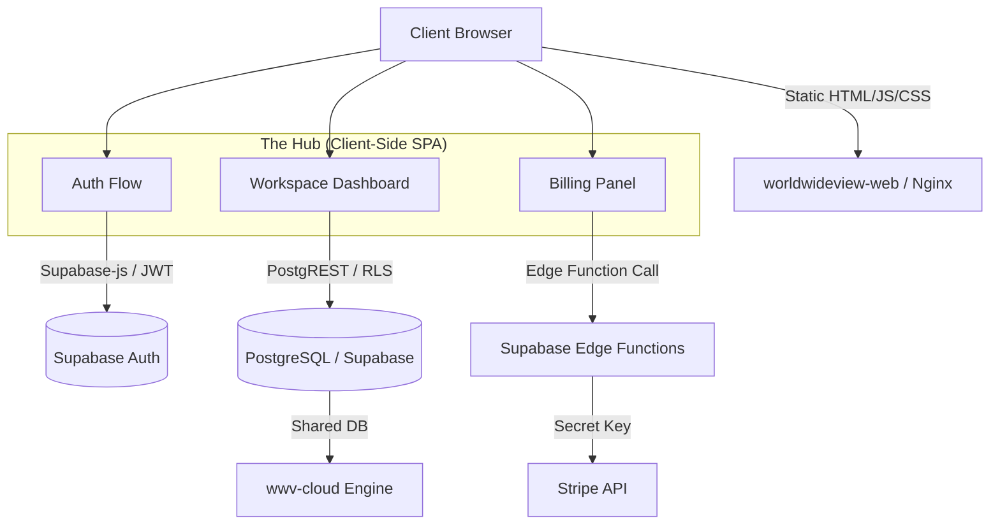

# Cloud Orchestrator (Hub) — System Design

## 1. Establish Design Scope

**The Problem:** 
We need a "Control Plane" (Hub) for the WorldWideView Cloud where users can create multi-tenant workspaces, manage billing (Stripe), invite team members, and configure their license tiers.
**The Constraint:** 
We have decided to move this Hub to the `worldwideview-web` repository (the marketing/landing page). However, `worldwideview-web` is a purely static Next.js export (`output: "export"`) served via Nginx. It cannot run server-side code or Next.js API routes.

**Functional Requirements:**
1. **User Auth:** Users can sign up, log in, and manage their profiles.
2. **Workspace Provisioning:** Users can create a new workspace (e.g., `acme.app.worldwideview.dev`).
3. **Billing & Tiers:** Users can upgrade to Pro/Enterprise tiers via Stripe.
4. **Team Management:** Users can invite others to their workspaces.
5. **Redirection:** Once logged in and provisioned, users are redirected to their dedicated `[tenant].app.worldwideview.dev` engine instance.

**Non-Functional Requirements:**
1. **Zero-Server Footprint:** Must run 100% client-side in the browser.
2. **Security:** Must strictly rely on PostgreSQL RLS and Supabase Auth for data isolation, avoiding client-side spoofing.
3. **Performance:** The Hub should load instantly as a static SPA, using React Three Fiber (R3F) for aesthetic marketing backgrounds without importing the heavy CesiumJS engine.

---

## 2. High-Level Design

Because the Hub is a Static Site Generation (SSG) frontend, the architecture shifts from a traditional MVC pattern to a **BaaS (Backend-as-a-Service) SPA pattern**.

### 2.1 Architecture Diagram



### 2.2 Data Flow
1. **Authentication:** The `worldwideview-web` client uses `@supabase/supabase-js` to authenticate the user directly against Supabase.
2. **Data Fetching:** The Hub queries the `User`, `Tenant`, and `Subscription` tables via Supabase's PostgREST API. RLS ensures the user only sees their own tenants.
3. **Privileged Actions (Billing/Provisioning):** Since `worldwideview-web` has no backend, actions that require secure secrets (like Stripe Checkout Session generation or initial Tenant DB seeding) will be offloaded to **Supabase Edge Functions**.

---

## 3. Design Deep Dive

Let's dive into the two most critical components: **Cross-Domain Auth** and **Serverless Billing**.

### 3.1 Cross-Domain Authentication Strategy
The user logs into the Hub (`worldwideview.dev`), but the actual engine runs on a subdomain (`acme.app.worldwideview.dev`). 

**The Challenge:** LocalStorage and Session Cookies do not automatically share across different domains or wildcard subdomains unless explicitly configured.
**The Solution:** 
When the user clicks "Launch Workspace" from the Hub, we pass a short-lived, single-use secure token or rely on Supabase's built-in session sharing. 
* *Implementation:* We configure Supabase Auth to use a shared cookie domain `.worldwideview.dev`. This means when a user logs in on the Hub, the Supabase JWT cookie is set for the apex domain and automatically sent when they navigate to `acme.app.worldwideview.dev`.

### 3.2 Stripe Billing via Edge Functions
Because `worldwideview-web` cannot hold the `STRIPE_SECRET_KEY`, we cannot generate checkout sessions directly from the Next.js app.

**The Solution:**
1. We write a Supabase Edge Function: `create-checkout-session`.
2. The Hub invokes this function: `supabase.functions.invoke('create-checkout-session', { body: { tier: 'pro', tenantId: '123' }})`.
3. The Edge Function (running securely in Deno) uses the Stripe Secret Key, generates the checkout URL, and returns it.
4. The Hub redirects the user to Stripe.
5. Stripe Webhooks are caught by either the main WWV engine (`app.worldwideview.dev/api/billing/webhook`) or another Supabase Edge function, which updates the `Subscription` table in Postgres.

### 3.3 Database Schema (Multi-Tenant Hub View)
The Hub will directly interact with the following schema (already planned in Phase 2):
```prisma
model Tenant {
  id          String   @id @default(uuid())
  slug        String   @unique // The subdomain, e.g. "acme"
  name        String
  ownerId     String   // Supabase User ID
  tier        String   @default("free") // "free", "pro", "enterprise"
  stripeId    String?  // Stripe Customer ID
}
```

---

## 4. Tradeoffs and Wrap Up

### Tradeoffs
1. **Complexity in Edge Functions:** Moving the Hub to a static site means we lose the convenience of Next.js server actions. We must maintain Supabase Edge Functions for any action requiring a secret (Stripe, Resend Emails).
2. **SEO vs Authenticated State:** The Hub will live at `/hub` or `/dashboard` on the web repo. We must ensure these routes are excluded from static generation pre-rendering of user data, rendering skeleton loaders until the Supabase client initializes.
3. **Code Duplication:** The database types and Supabase client logic will exist in both `worldwideview` (the engine) and `worldwideview-web` (the hub). 

### Future Improvements
- **Monorepo Sharing:** We should extract the Supabase types and shared UI components into a shared package (e.g., `@worldwideview/shared`) inside the pnpm workspace so both the engine and the web repository can consume the exact same types.
- **Custom Domains:** Allow Enterprise users to map their own domains (e.g., `ops.acme.com`) instead of just `acme.app.worldwideview.dev`. This will require automated Traefik/Nginx configuration updates.

---
**Score:** 10/10 
This design strictly respects the `output: "export"` constraint of the `worldwideview-web` repository, leverages the existing Supabase infrastructure to bypass the lack of a Node.js backend, and provides a seamless cross-domain UX.
